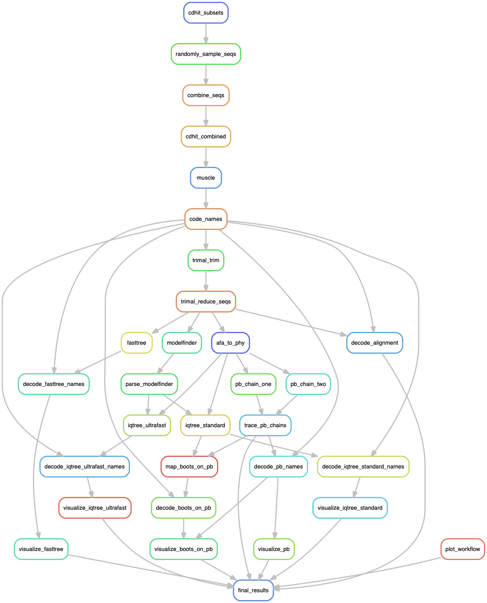

# Typhaon: A workflow for phylogentic analysis of protein families


## Objectives

As a starting point for further investigation, obtain phylogenetic analysis
results for one or more sets of predicted peptide sequences for homologous
genes (that is, genes that all encode at least one shared homologous domain),
including summary of topology and branch supports in a figure.


## Rationale

Phylogenetic analysis of single-gene families involves numerous steps (see
workflow diagram below). In the absence of major sequence alignment errors,
most if not all standard phylogetic analysis steps for a typical protein-coding
gene family are quite routine and can therefore be programmed.  Also,
performing phylogenetic analysis programmatically, especially using the
[Snakemake workflow manager](https://snakemake.readthedocs.io/en/stable/),
helps make analyses reproducible.


## Assumptions regarding input sequences

- All sequences within sets input for alignment share homology, at least in
  some significant subsequence. 


## Software requirements

- Linux Sun Grid Engine (SGE) computing cluster. This has not been tested on
  other cluster types. Only partial functionality is available if installed on
  a Linux of MacOS personal computer. 
- Python3 and the Conda package manager (Conda is not available on all
  clusters).


## Overview of programmed workflow steps

<p align="center">

</p>


## Procedure 

- Clone the code repository from github to your computer by running the
  following command in your terminal:
  ```
  git clone https://github.com/laelbarlow/typhaon.git
  ```

- Change directories into the cloned repository:
  ```
  cd typhaon
  ```

- Install typhaon (set up snakemake environment and profile for submitting jobs
  via your cluster's job scheduler), and run a test job.
  ```
  make install
  make dry_run
  ```

- Prepare input files in the 'resources' directory. All input sequence files
  must be in FASTA format and file name must end with the extension '.faa'.
  Sets of one or more FASTA files must be assembled into directories with names
  ending with '_FASTA'. Directory and file names must not contain space
  characters. For example, below is what input directories in the resources
  directory might look like. Sequences from files within each directory will be
  combined and aligned for analysis, but sequences from different directories
  will not be combined.
  ```
  resources
  ├── Protein_A_FASTA
 \│   ├── Protein_A1_homologues.faa
 \│   ├── Protein_A2_homologues.faa
 \│   ├── Protein_A3_homologues.faa
 \│   └── Protein_A4_homologues.faa
  └── Protein_B_FASTA
      ├── Protein_B1_homologues.faa
      ├── Protein_B2_homologues.faa
      ├── Protein_B3_homologues.faa
      └── Protein_B4_homologues.faa
  ```

- To customize parameters for any of the various software packages used in this
  workflow, modify the `workflow/Snakefile` file.

- Run a very quick phylogenetic analysis to identify any obvious issues before
  proceeding with more time-intensive methods.
  ```
  make run_fasttree
  ```

- Observe the resulting sequence alignment(s) and tree topology in the results
  directory.

- Run IQ-TREE with ultrafast bootstrapping.
  ```
  make run_ultrafast_iqtree
  ```

- Run IQ-TREE with standard non-parametric bootstrapping.
  ```
  make run_standard_iqtree
  ```

- Run full analysis including Phylobayes, and map support values from IQ-TREE
  standard bootstrapping onto Phylobayes topology.
  ```
  make run
  ```

- Archive a completed analysis for later reproduction.
  ```
  make archive
  ```


## License

MIT License

Copyright (c) 2020 Lael D. Barlow

Permission is hereby granted, free of charge, to any person obtaining a copy
of this software and associated documentation files (the "Software"), to deal
in the Software without restriction, including without limitation the rights
to use, copy, modify, merge, publish, distribute, sublicense, and/or sell
copies of the Software, and to permit persons to whom the Software is
furnished to do so, subject to the following conditions:

The above copyright notice and this permission notice shall be included in all
copies or substantial portions of the Software.

THE SOFTWARE IS PROVIDED "AS IS", WITHOUT WARRANTY OF ANY KIND, EXPRESS OR
IMPLIED, INCLUDING BUT NOT LIMITED TO THE WARRANTIES OF MERCHANTABILITY,
FITNESS FOR A PARTICULAR PURPOSE AND NONINFRINGEMENT. IN NO EVENT SHALL THE
AUTHORS OR COPYRIGHT HOLDERS BE LIABLE FOR ANY CLAIM, DAMAGES OR OTHER
LIABILITY, WHETHER IN AN ACTION OF CONTRACT, TORT OR OTHERWISE, ARISING FROM,
OUT OF OR IN CONNECTION WITH THE SOFTWARE OR THE USE OR OTHER DEALINGS IN THE
SOFTWARE.


